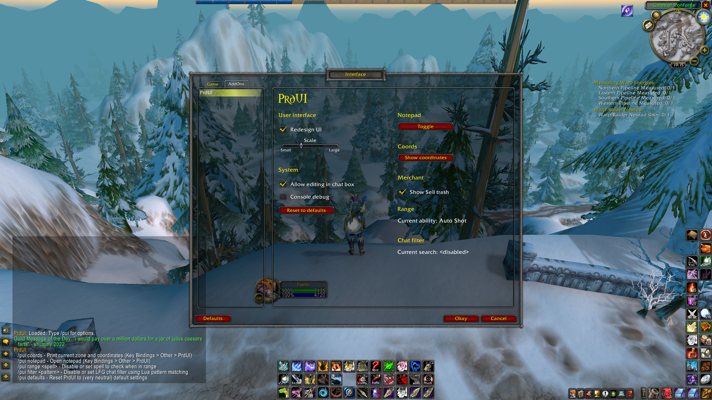

# PrdUI

WoW Classic AddOn.

- Clean
- Few options
- Sane defaults
- Nonintrusive

Apart from a UI redesign, it also boasts coordinates and notepad modules.

## Install

Download the zip file and extract the `PrdUI` folder in `World of Warcraft\_classic_\Interface\AddOns`.

While in-game, type `/pui` for options.
